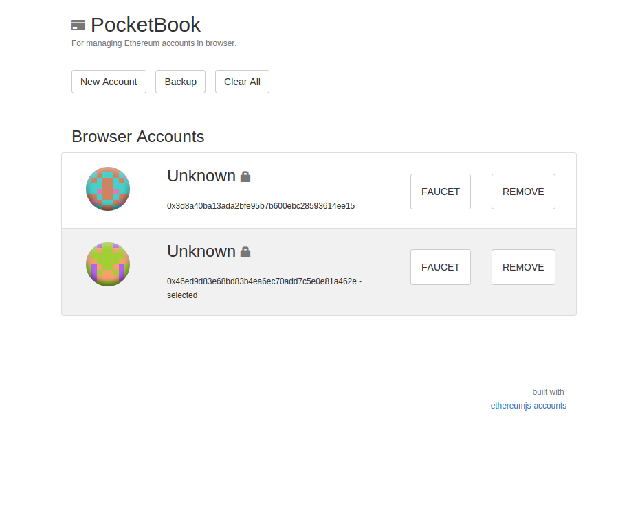

## Synopsis

A mini-wallet for Meteor Ethereum dApps.



## About

PocketBook provides MeteorJS dApp's with a simple and easy-to-use  Ethereum mini-wallet. 

Please note that this Meteor module is still in Alpha. The security status of this module is still unknown and must still be vetted by trusted third-parties before production use.

## Hosted Alpha

<a href="http://meteor-pocketbook.meteor.com">http://meteor-pocketbook.meteor.com</a>

## Install

    $ meteor add silentcicero:meteor-pocketbook
    
## Usage

Note, the `PocketBook` object is set as a global variable in Meteor. You must setup your own route to the PocketBook view template `views_pocketbook`.

```javascript
// Setup A Route to the PocketBook view
Router.route('/pocketbook', {
    template: 'views_pocketbook',
    name: 'pocketbook'
});
```

PocketBook with a <a href="https://github.com/ConsenSys/hooked-web3-provider">HookedWeb3Provider</a> setup and in-browser web3 transaction signing.

```javascript
// Setup An ethereumjs-accounts instance
accounts = new Accounts();

// Setup a HookedWeb3Provider for in-browser account signing
// use Meteor.settings.public.httpProvider
var provider = new HookedWeb3Provider({
  host: 'http://localhost:8545',
  transaction_signer: accounts
});
web3.setProvider(provider);

// Setup PocketBook with Accounts Instance
PocketBook.Accounts(accounts);
```

PocketBook callback usage, note all other callbacks have no input variable for their callback method.

```javascript
PocketBook.onNew(function(address){
    console.log('My new account,', address); 
});

PocketBook.onFaucet(function(address){
    console.log('My faucet account,', address); 
});

PocketBook.onRemove(function(address){
    console.log('Removed account,', address); 
});

PocketBook.onSelect(function(address){
    console.log('Selected account,', address); 
});
```


## API

- [`PocketBook`](#pocketbook)
    - [`PocketBook` Properties](#pocketbook-properties)
        - [`Accounts.names`](#pocketbook-names)
        - [`Accounts.options`](#pocketbook-options)
    - [`PocketBook` Methods](#pocketbook-methods)
        - [`PocketBook.Options(optionsObject)`](#method-Options) 
        - [`PocketBook.Names(namesObject)`](#method-Names) 
        - [`PocketBook.Accounts(accountsInstance)`](#method-Accounts) 
        - [`PocketBook.NewPromt(method)`](#method-NewPromt)
        - [`PocketBook.RemovePromt(method)`](#method-NewPromt)
        - [`PocketBook.FaucetPromt(method)`](#method-NewPromt)
        - [`PocketBook.onFaucet(method)`](#method-onFaucet) 
        - [`PocketBook.onNew(method)`](#method-onNew) 
        - [`PocketBook.onBackup(method)`](#method-onBackup) 
        - [`PocketBook.onImport(method)`](#method-onImport) 
        - [`PocketBook.onExport(method)`](#method-onExport) 
        - [`PocketBook.onClear(method)`](#method-onClear) 
        - [`PocketBook.onSelect(method)`](#method-onSelect) 
        - [`PocketBook.onRemove(method)`](#method-onRemove)

## Options

These options will turn specific PocketBook features on and off. The `selectedAsDefault` option can be used if you want the `web3.eth.defaultAccount` to be set when a user selects an account with PocketBook. The `selectedAsDefault` option is set to `true` by default.

```javascript
PocketBook.Options({
    canFaucet: true,
    canRemove: true,
    canClear: true,
    canCreate: true,
    canBackup: true,
    canSelect: true,
    canExport: true,
    canImport: true,
    nodeAccounts: true,
    checkBalances: true,
    selectedAsDefault: true,
    canNodeSelect: true,
    canBrowserSelect: true,
});
```

## Balances

Balances are updated every block. You may shut off balance checking by turning off the `checkBalances` option, which is set to `true` by default.

## Accounts (Node/Browser)

PocketBook can load both the available (geth/cpp) node and in-browser accounts. You can disable loading and displaying node accounts by setting the PocketBook option `nodeAccounts` to `false`.

The selected account will be stored in persistent browser local storage. Using ethereumjs-accounts `selected` feature.
        
## Bootstrap

PocketBook contains classes that are Bootstrap 3.0 enabled. However, boostrap and custom CSS are also supported. Boostrap is not explicitly contained within PocketBook.

To see PocketBook with it's Bootstrap layout quickly, paste this HTML into your code:

```html
<link rel="stylesheet" href="https://maxcdn.bootstrapcdn.com/bootstrap/3.3.5/css/bootstrap-theme.min.css">
```

## CSS/LESS

```
.pocketbook
    &.container
    .pocketbook-header
    .pocketbook-subheader
    .list-pocketbook-nav
        .list-group-item
    .pocketbook-accounts-header
    .pocketbook-accounts-header-node
    .pocketbook-accounts-header-browser
    .list-pocketbook-account
        &.selected
        .pocketbook-account-header
        .pocketbook-account-body
            .pocketbook-account-address
            .pocketbook-account-balance
            .pocketbook-account-selected
        .pocketbook-account-faucet
            .btn-pocketbook-faucet
        .pocketbook-account-remove
            .btn-pocketbook-remove
        .pocketbook-account-footer
    .pocketbook-footer
```

## Names

All PocketBook names are stored in the `PocketBook.names` data object. Where `PockBook.names[SOME_ADDRESS_STRING] = 'SOME NAME';`. This can be integrated with a standard NameReg contract.

## Signing Transactions (in-browser)

Because PocketBook is built with ethereumjs-accounts, you may use the <a href="https://github.com/ConsenSys/hooked-web3-provider">HookedWeb3Provider</a> to do in-browser account signing with your PocketBook accounts.

You can install the HookedWeb3Provider in meteor, by using my package here:

    $ meteor add silentcicero:hooked-web3-provider
        
## Components

* [underscore.js](http://underscorejs.org) v1.8.3
* [localstorejs](https://github.com/SilentCicero/LocalStore)  v0.1.9
* [ethereumjs-acccounts](https://github.com/silentcicero/ethereumjs-accounts) v0.0.12

## Security

Please use extreme caution when using this in any production or development level application. This wallet has not been verified secure by any organization or third-party. The security of this module is still unknown, and I do not in any way guarantee it to be secure or ready for production use.

## Licence

Released under the MIT License, see LICENSE file.